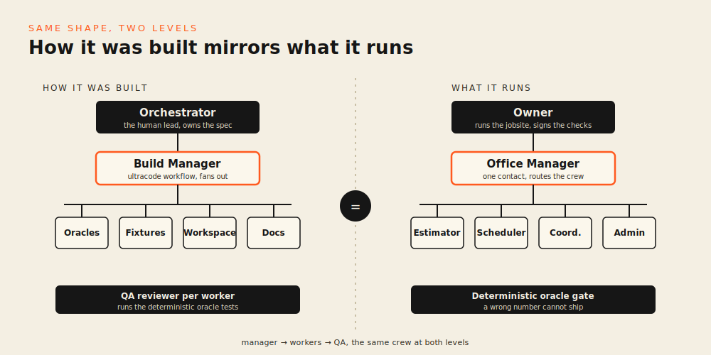

# Baxie Digital Back Office

**You run the jobsite. Your agents run the office.**

A crew of digital employees for residential general contractors. The owner runs the
physical world. The crew runs the business: estimates, schedules, change orders,
invoices, reminders. A two-person shop operates like a ten-person one, on day one.

## The problem

A new residential GC is good at building. They are buried in everything else.
Estimates take nights and weekends. Schedules slip because nobody re-sequences the
trades when scope changes. Change orders get verbal-only and never signed. Margin
leaks out of the job before anyone notices. The work that protects the margin is the
office work, and the owner is the only one doing it.

This crew does that office work. The owner stays on the jobsite.

## The crew

One human contact. Five digital employees. The owner talks only to the Office
Manager, who routes the work.

```
                         Owner (you)
                              |
                       Office Manager          single human contact + router
                              |
        +---------+-----------+-----------+-------------+
        |         |           |           |             |
   Estimator  Scheduler   Project      Office Admin   (oracles)
   (pre-con)  (pre-con)   Coordinator  (paperwork)    hard QA gate
                          (during      change orders,
                          construction) invoices,
                          RFIs,         reminders
                          progress,
                          margin flags
```

- **Office Manager** is the single human contact and the orchestrator. Classifies
  the request, declines out-of-scope asks, routes only in-scope work to the right
  worker. Workers are not addressable directly.
- **Estimator** prices scope. Calls the estimate oracle as a tool, reads violations,
  repairs, re-submits until clean.
- **Scheduler** sequences the trades (pre-construction). Calls the schedule oracle,
  fixes trade-order violations, re-submits until clean.
- **Project Coordinator** runs the job during construction: RFIs, progress versus
  schedule, margin-leak flags.
- **Office Admin** produces the paperwork: change orders, invoices, reminders.

## The hero demo

A kitchen remodel, mid-construction, baseline contract around $42,000. The homeowner
asks to add an egress window. Watch the crew price it, catch its own mistakes against
the deterministic oracles, and close the loop.

Two self-corrections, both confirmed by an oracle on screen:

1. **Estimator.** First pass double-counts the framing labor for the rough opening
   (the header gets framed twice, about 6 hours and $540 of inflated labor).
   `check_estimate` flags `quantity_mismatch`. The Estimator repairs and re-submits.
   Clean estimate: subtotal around **$2,080**, **$2,496** with markup.
2. **Scheduler.** First pass schedules the window rough-framing AFTER drywall.
   That is illegal: you cannot frame a new opening once the wall is closed.
   `check_schedule` flags `trade_inversion`. The Scheduler re-sequences framing
   before rough-in, inspection, and drywall. Valid schedule, **+2 days**.

Then the Office Admin issues **Change Order #001** ($2,496, +2 days), an updated
invoice, and a reminder that the change order needs the owner's signature. The owner
signs.

A hallucinated number cannot ship. The oracle is a hard gate.

## This is a Baxie feature

Baxie is the Margin OS for general contractors. This crew is a clean-room instance of
Baxie's digital employees: synthetic data only, no client data, no Baxie schema. The
same crew lives inside the main app, working from the real job. Here it runs offline
so judges can see the whole picture in one command.

## How it was built

The dev-time orchestration mirrors the product. A build manager fanned out parallel
worker subagents, each paired with a reviewer subagent that ran the oracle tests.
Manager, workers, QA. The same shape as the crew that runs the office.



Full write-up: [docs/HOW-IT-WAS-BUILT.md](docs/HOW-IT-WAS-BUILT.md).

## How to run

```bash
pip install -r requirements.txt
python run.py            # runs the change-order scenario, prints the feed + scoreboard, exits 0
```

For the workspace UI:

```bash
python run.py --serve    # then open the FastAPI URL
```

The hero run replays from a deterministic cache, so the workspace cannot stall on a
live API. The URL can also run live.

## Links

- [SPEC.md](SPEC.md): the build spec
- [rubric.md](rubric.md): the machine-verifiable definition of done
- [docs/CREW.md](docs/CREW.md): each digital employee, what they can and cannot do
- **Live URL**: https://gc-back-office.vercel.app
- **TODO: 1-min video**: _(add demo video link here)_
